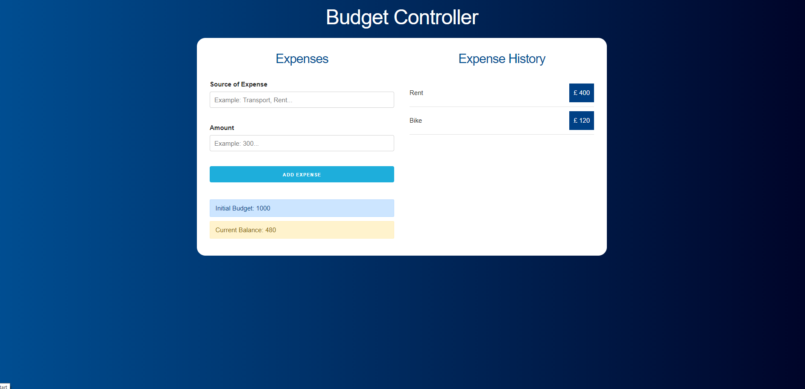
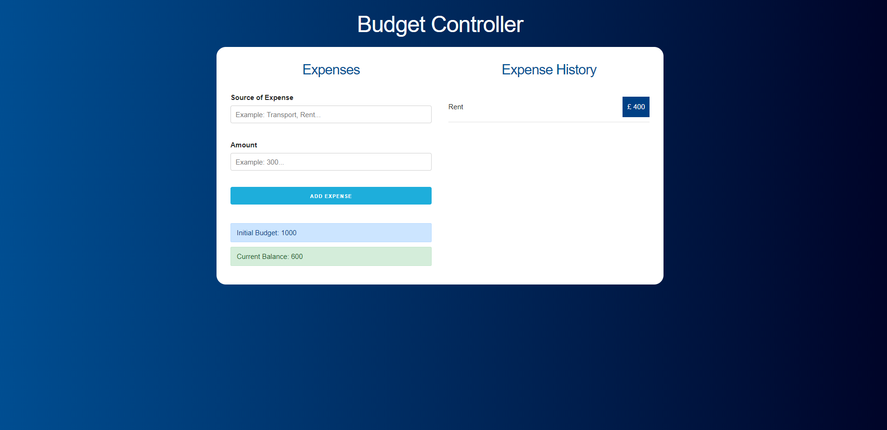

# budget-controller

 

## Built With

* [React](https://reactjs.org/)
* [React Hooks](https://es.reactjs.org/docs/hooks-intro.html)
* [NodeJs](https://nodejs.org/en/)
* [JavaScript](https://en.wikipedia.org/wiki/JavaScript)
* [Css](https://en.wikipedia.org/wiki/CSS)
* [Skeleton](http://getskeleton.com/)


## Getting Started

### Prerequisites

For this project you need:

```
Nodejs
```

### Installing

Go to /budget-controller/budget-controller and run:

```
npm install
```

## Running React

In the same folder run:

```
npm start
```

Now you can use Budget-controller!

### Result

* Add your Budget:

 

* Your Balance is green when it is more than 50% :money_mouth_face: :money_mouth_face:

 

* If the Balance is between 25% and 50% the box turn yellow... Warning! :slightly_smiling_face: :slightly_smiling_face:

 

* If it is less than 25% it will be red... Danger! :upside_down_face: :upside_down_face:

 
